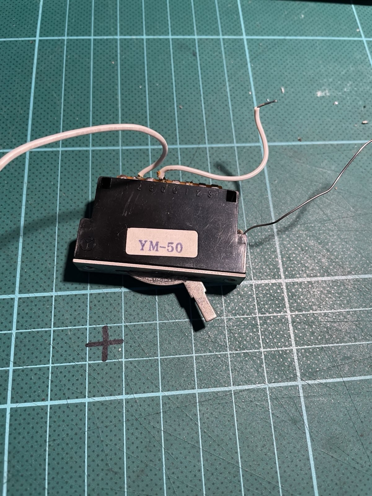

+++
title = "I rewired my guitar"
date = 2025-04-04
+++

After decades of saying I would fix its extremely unreliable jack output, pots
and switch, I finally got around to rewiring my crackly Japanese Fender
Stratocaster. It was simpler than I thought, though I needed to relearn how to
solder on the job. This is a collection of resources I wished I had in one
place at the beginning.

## A simpler fix

I could've probably made the thing work by resoldering the jack output.
However, I wanted to get better at soldering, and a broken guitar seemed like a
good place to start before I started to build my far more complex new 3D
printer (build log to follow).

If you're here looking for advice on how to fix a crackly jack, just unscrew
it, inspect for loose solder, redo it and you're probably good. The rest of
this post is about a full rewire.

## Sourcing

I ordered [this rewiring kit from Axes R
Us](https://www.axesrus.co.uk/Standard-Wiring-Kit-Suitable-for-Stratocaster-p/swiringkit.htm).
I considered other sites, but they often had too much choice for particular
mods I didn't understand.

Replacing the pickups wasn't part of the plan, nor was adding copper shielding.

What I got in the kit:

- Three potentiometers that read between 0 and 235-240kΩ.
- An Oak Grisby 5-way switch.
- An 'orange drop' capacitor.
- A new jack socket.
- Some pretty hefty hookup wire, with black and white movable sleeve insulation.
- Some washers, nuts and screws.

## My mistake: YouTube

YouTube is great for building confidence that you can do things, but it's not
always great for showing you how, especially when a project needs precision. I
followed [a tutorial from someone experienced at rewiring
guitars](https://www.youtube.com/watch?v=2EzJI7Bj8qU&t=1885s), and had my
soldering iron hot while I followed along. It seemed straightforward.

Sadly, once I'd followed everything in the video, there was no sound from the
pickups. So there must've been one of these problems:

- A 'cold' solder joint
- A short
- Miswiring

In retrospect, it was probably the last one.

In my excitement at having persuaded my brain that now was the time to do this
repair, I hadn't bothered to study diagrams or to learn how the components I
was replacing worked.

## Diagrams

For me, diagrams are often far more enlightening than videos.

The official Fender diagram for wiring is OK but lacks colour:

At first glance, it looked like I'd miswired the capacitor between the two tone
pots. I resoldered everything to match the diagram, only to realise that it was
the same layout with more wire.

In fact, I'd miswired the new Oak Grisby 5-way switch (and also failed to find
[Axesrus' instructions for soldering the
switch](https://www.axesrus.co.uk/Oak-Grigsby-Lever-Switch-p/519xx.htm), which
I only found whilst writing this post). My original, crackly old
switch was a cheap thing that was either a replacement or what they happened to
put in at the factory in Japan in the 90s. I couldn't use it as a reference, as
it's a different design. I believe this is the design they also put into Squier Strats:

But I'd received this:

## Mistake rectified, with... YouTube.

[This video](https://www.youtube.com/watch?v=Md9Ai1YIdn0) explains with a
diagram how to wire these "vintage style" 5 way switches. Taking the time to
understand how to wire this thing, instead of blindly following a tutorial,
made everything make sense. You need to "activate" the second side of the
switch, and the order of the lugs really does make sense. Would labelling them
be too much to ask?

## All done!

So after getting the wiring right, and desoldering and resoldering several
times, and then restringing, the thing made a noise! That is, until I touched
the volume pot. Then, permanent silence.

## Not so fast

I had a cold solder joint on the volume pot. I redid it and tested the pickups
by scratching their magnets with a drill bit.

But... nothing. I think I blew the pot somehow. I replaced it with the original
volume pot and things started working again.

My advice: don't buy this guitar from me unless you want to redo my work.
However, I'd also recommend learning this stuff if you do play electric, as it
helps you understand where tone comes from, and how to change the sound of your
instrument for the price of a few cocktails and some lost hair.
