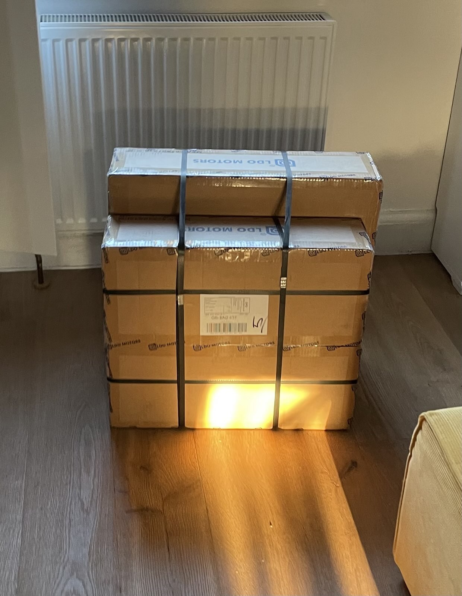
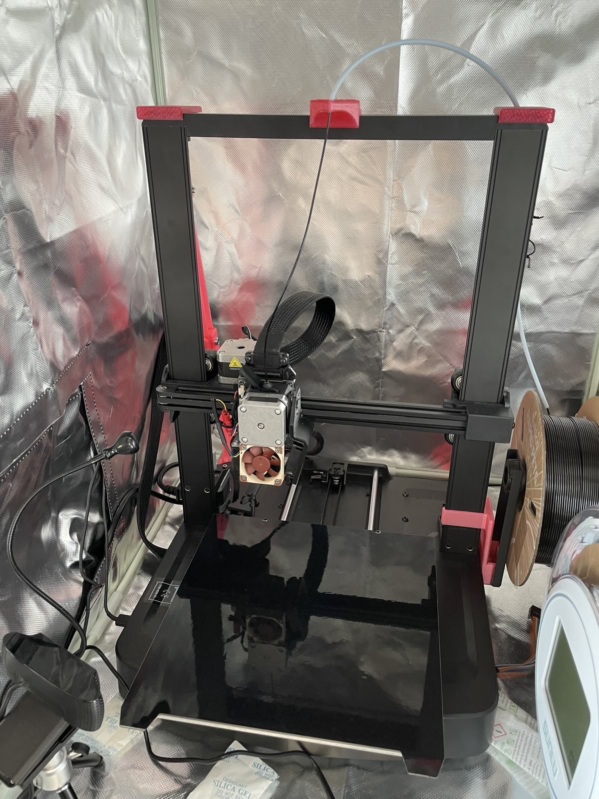
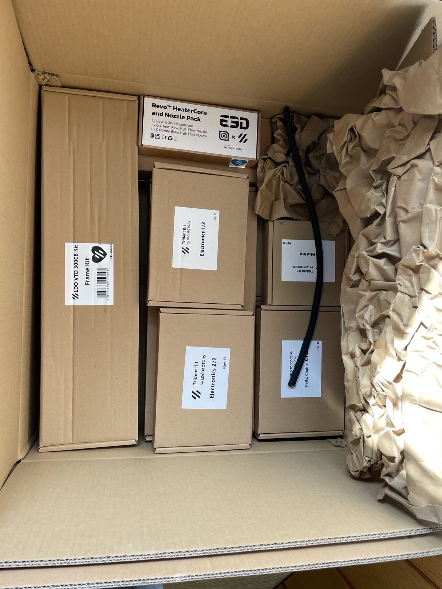

+++
title = "Voron Trident 300 Build: Part 1"
date = 2025-04-04
+++

My LDO box arrived this week and I'm excited to get started on my first 3D
printer build.

I've previously used and modded this cheapo Ender 3 V3 SE. I ripped out the
original firmware and installed Klipper, and it's currently controlled from an
[old Librebooted Thinkpad X200 running
NixOS](https://github.com/code-supply/code-supply/tree/main/boxes/x200) (of
course). I'm hoping to either control the Voron from this laptop too, or go and
do the usual thing and get a Raspberry Pi. It'll obviously need to [run
NixOS](https://nixos.wiki/wiki/NixOS_on_ARM/Raspberry_Pi_4) too. I'm not down
with [that wheel-reinventing KIAUH stuff](https://github.com/dw-0/kiauh).

As is my curse, I'm choosing the hard path to begin: printing my own parts in
glorious stinky ABS. One advantage of this is that I can choose my own mods as
I build. The obvious disadvantage is that I'm about to get unpopular at home,
and possibly very upset with my feeble Ender.

If that fails, I'll probably order the parts from the
[Print It Forward](https://pif.voron.dev/) programme to utilise someone's
well-tuned and fast printer (farm).

## Unboxing

This is how the main box looks when opened. I need to get the frame together
and squared, then look at printing one of those special special idler mods all
the YouTubers are fussing over.

