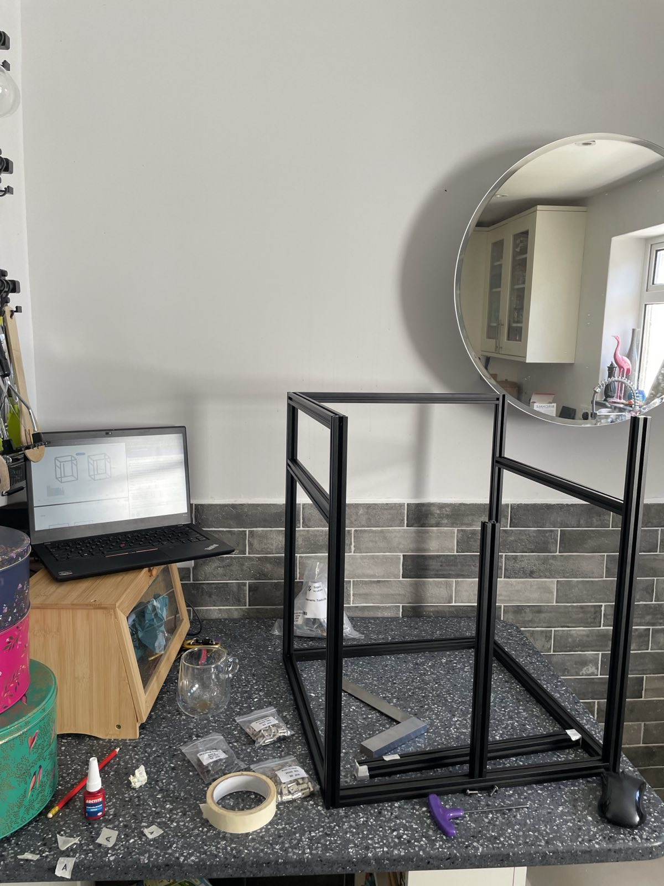

+++
title = "Voron Trident 300 Build: Part 2"
date = 2025-04-05
+++

Day 2 of the Trident build! I got the basic extrusions together to form a frame
and starting printing my first ABS on the Ender.

My main frustrations today were to do with [LDO differences to the regular
Voron
instructions](https://docs.ldomotors.com/en/voron/voron-trident/build-faq):

- T-nut bars should be added whilst building the frame (guess who didn't do this?)
- 250 vs 300 instructions and exceptions are pretty hard to follow

I got the whole thing squared before getting some help from Jon on the Voron Discord:

Added the T-bars:

Resquared, and here's the final result:

As for printing the parts, I needed to:

- Get over my fear of ABS
- Zip that ventilated enclosure up tight
- Wear a respirator just in case
- Let my printer go [slightly above its existing 100°
  bed](https://github.com/code-supply/code-supply/commit/eca35246f628a7aa3d1a46cfb6bc873308d365a6)
  and [260° extruder limits](https://github.com/code-supply/code-supply/commit/4ca47c73ed1d5ce8d5c2cc2dafe6203556389434)
- [Stop my printer from going cold after a timeout](https://github.com/code-supply/code-supply/commit/5c08291755f4aaf804dd59d9505a5113db1817a2) ('heat soaking', or warming up your chamber is supposed to be useful for ABS)
- Do test prints like [pressure
  advance](https://ellis3dp.com/Print-Tuning-Guide/articles/pressure_linear_advance/pattern_method.html)
  and so on, and figure out bed adhesion.
