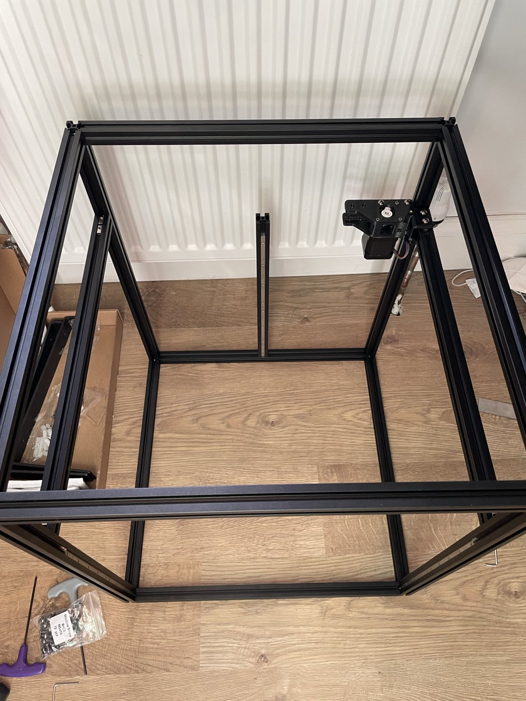
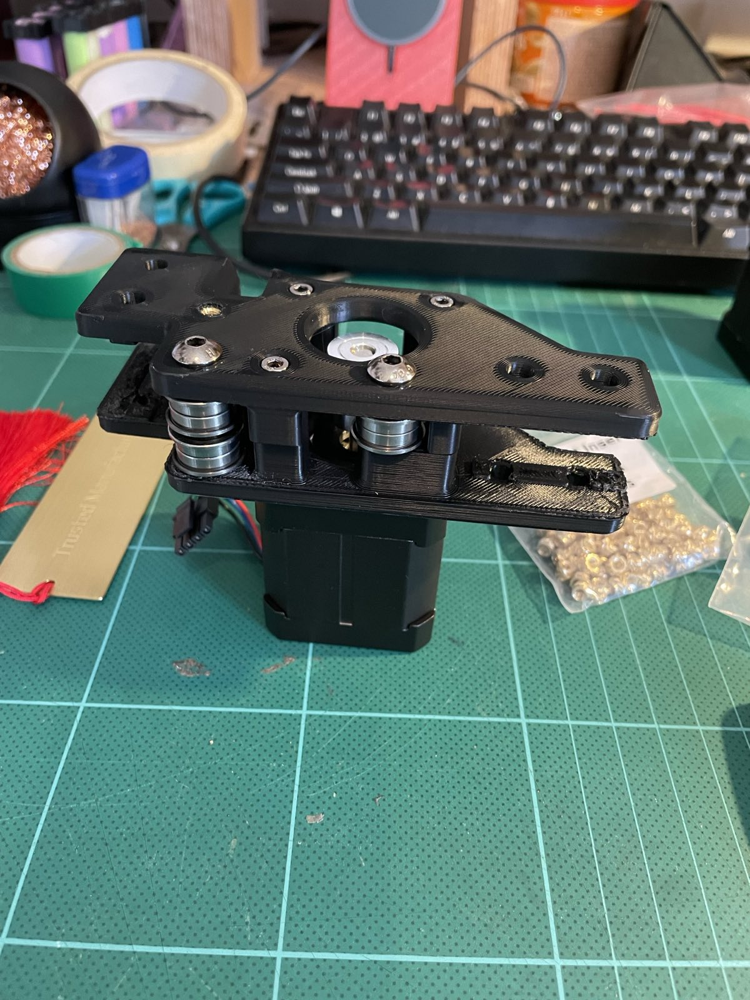
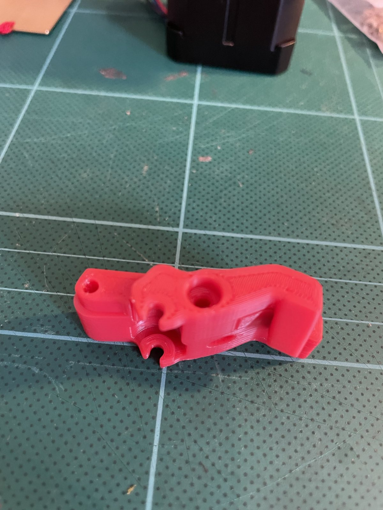
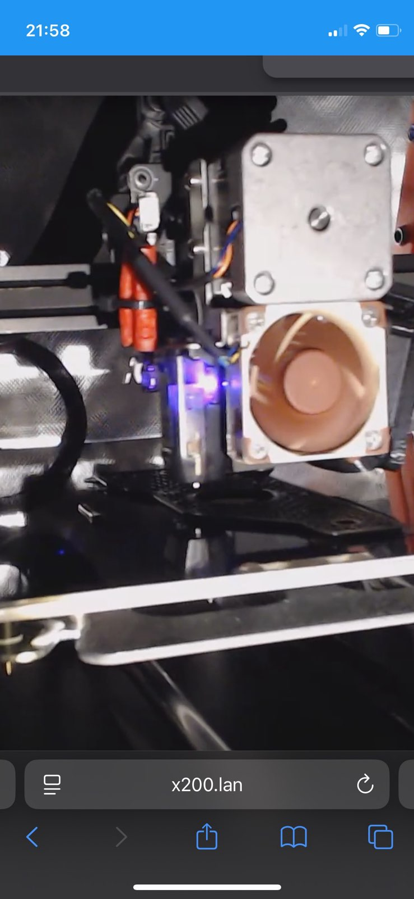

+++
title = "Voron Trident 300 Build: Part 3"
date = 2025-04-07
+++

Day 3! I've had some fun with ABS printing but have managed to get the A drive
frame printed and mounted, as well as correcting half of a mistake.

The Y-axis extrusions now have a T-bar facing down. The orientation isn't
called out in the LDO instructions. Instead, they rely on you finding the right
place in the Voron manual for the T-nuts and correlating. This is really
difficult to get right when you have no idea how the thing looks eventually,
and when videos online don't even use these bars.

Spot the remaining mistake! Those front extrusions should have a T-bar facing
the back, not the sides. I'll need to disassemble *again*.

## DIY

This is a DIY project. If I wanted a printer right now, I'd buy an X1C or one
of its cheaper clones. But most of those aren't open-source and are for a
consumer who wants to get stuff done, rather than do donuts in the car park and
compare notes.

Part of my DIY disease is that I want everything to be done from scratch.
That's the case with the printed parts. I got a huge kick from printing the
casing for the motor and fitting it to the frame, despite several misprints,
and the result being pretty ugly too:

I believe this will function correctly, though, as everything lines up as per
the manual.

Here's a future part for the Stealthburner toolhead that was recommended as a
test print:

## Hotend upgrade

For the price of nearly half of a Print It Forward order I'm still avoiding, I
decided to upgrade the hotend on the Ender V3 SE that I'm printing these parts
on. I've been struggling with prints at 250°, not least because the default V3
SE hotend isn't designed for it. In fact, it'll give off nasty fumes beyond
240°. That hasn't arrived yet, but the wonders of modern logistics mean it'll
be with me today.
