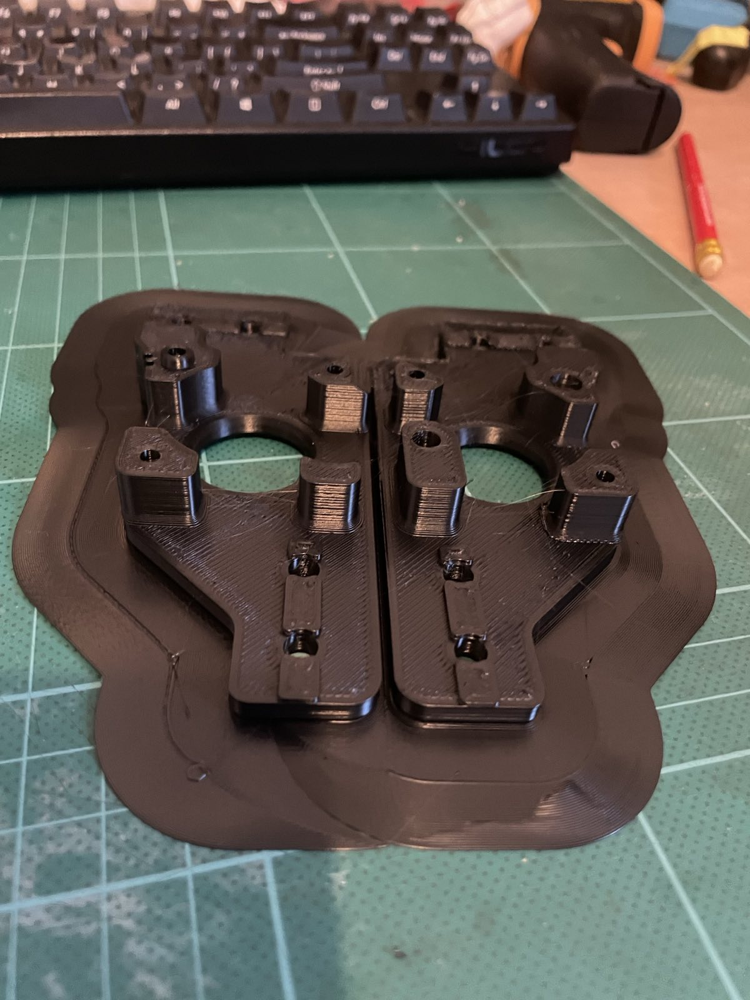
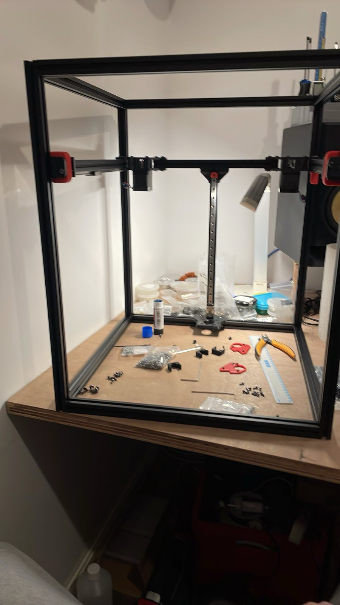

+++
title = "Voron Trident 300 Build: Part 4"
date = 2025-04-09
+++

It's been a couple of sessions since the last post, one of which was largely
spent installing and calibrating the new ceramic hotend in the V3 SE. The new
hotend lets me print up to 300 degrees, which is way more than is needed for
ABS.

Results have been generally good, with only one misprint since the new hotend,
and I think that was due to bed adhesion. Here's a drive print fresh off the
bed. I won't be signing up as a PIF provider any time soon, but it's far
superior to the prints I was getting before.

I now have motors, idlers, rear supports and rear Z rail installed.

Blurry photos make everything look better, right?!?
