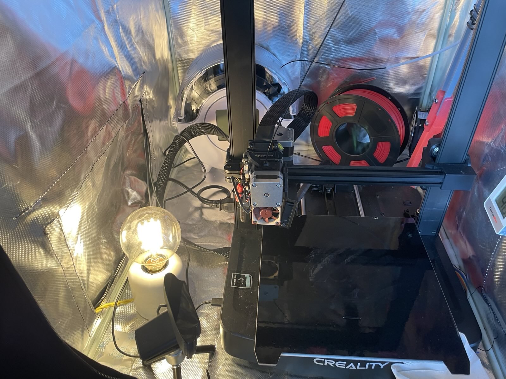

+++
title = "Voron Trident 300 Build: Part 5"
date = 2025-04-13
+++

Hello again! I've made some good progress on this Trident build.
We now have all motors mounted, legs fitted, belts routed and the carriage and
probe installed.

I'll go over some findings regarding ABS printing on the Ender 3 V3 SE, as well
as my thinking regarding probes and mods for this first printer build.

## Printing ABS on the Creality Ender 3 V3 SE

Things that made significant difference:

- Enclosure
- Thermometer inside the enclosure
- Large brim - 15-20mm
- High skirt for troublesome parts (2 wide, 10mm ish tall)

### Enclosure

I use the premade Creality enclosure with its extractor kit, routed to an
exterior window. It's a tent with holes in it, lined with fireproof insulating
material.

Being a tent with zips and holes, it's not a perfect seal. I've tried working
in the same room as it while printing ABS but got headaches and nausea. I now
wear a respirator while it's printing ABS and I want to do something for a
significant period in the same room.

However, despite not being good protection from fumes, it does retain heat
well. Which leads us to temperature.

### Temperature

I bought a cheap thermometer from Amazon and magnetised it to the side of the
enclosure, such that it can be viewed on camera (I have a webcam on legs
inside the enclosure).

To maintain sufficient heat inside the enclosure, and also to provide light for
the camera, I'm running a filament lamp located next to one of the flaps where
drafts can sneak in.

Before starting a print from cold, I'll turn the lamp on, set the bed heater to
100°ish degrees until it gets to 32°C. This temperature seems sufficient as a
starting point for ABS to prevent curling.

I don't run part fans at all. I tried this, but just got crazy curling.

### Bed adhesion

ABS is a different beast to PLA and PETG. Brims and skirts have become my
weapons of choice. Brims seem wasteful until you realise it's saving countless
failed prints. I'm actually starting to enjoy the process of peeling them off
and deburring. It feels like Christmas morning every day!

## Choice of probe

Bike-shedding seems to be the main activity amongst 3D printing enthusiasts.
There's prior art for alternatives for almost every component in a a Voron
printer. As this is my first build, I'm trying my best to not get distracted by
pin mods, idler mods and fancy probes.

My LDO rev D Trident kit comes with a choice of probe: Omron proximity or
Klicky. After some deliberation, I've decided to first install the older Omron
probe. Why? It's:

- The "royal path" - it's in the main manual for the Trident.
- Effortlessly easy to install.
- The same form factor as a more recent development, Eddy probes.

I'm building this printer at a time when there have been a few developments in
bed probe technology:

- Omron (mentioned in the manual)
- Klicky (3rd party, comes with the LDO kit)
- Voron Tap (from the Voron team)
- Eddy probes (seem like an easy and superior swap for Omron)

I get to skip the Klicky and Tap fussing and go straight to Eddy probes. I'm
sure there are plenty of downsides. For now, though, it's convenient that the
older Omron probe is an easy swap. So, I'll be building with that probe and
learning about its weaknesses before moving to some form of Eddy probe (it
seems there are a few).

## Mods

If you were to believe people on YouTube, you'd be crazy not to use
this-or-that mod for almost every aspect of a printer build. While it's great
that there's a thriving community of modders and contributions flowing upstream
to the Voron projects, I believe it's been beneficial for my progress on this
build to choose ease and simplicity over perfect rigidity or latest tech. YMMV:
choose the adventure you want!

In software, I find that choosing the default, "royal" path yields greater
flexibility and more readily-available community support. I'm hoping this is
the case in the printer hardware world also.
