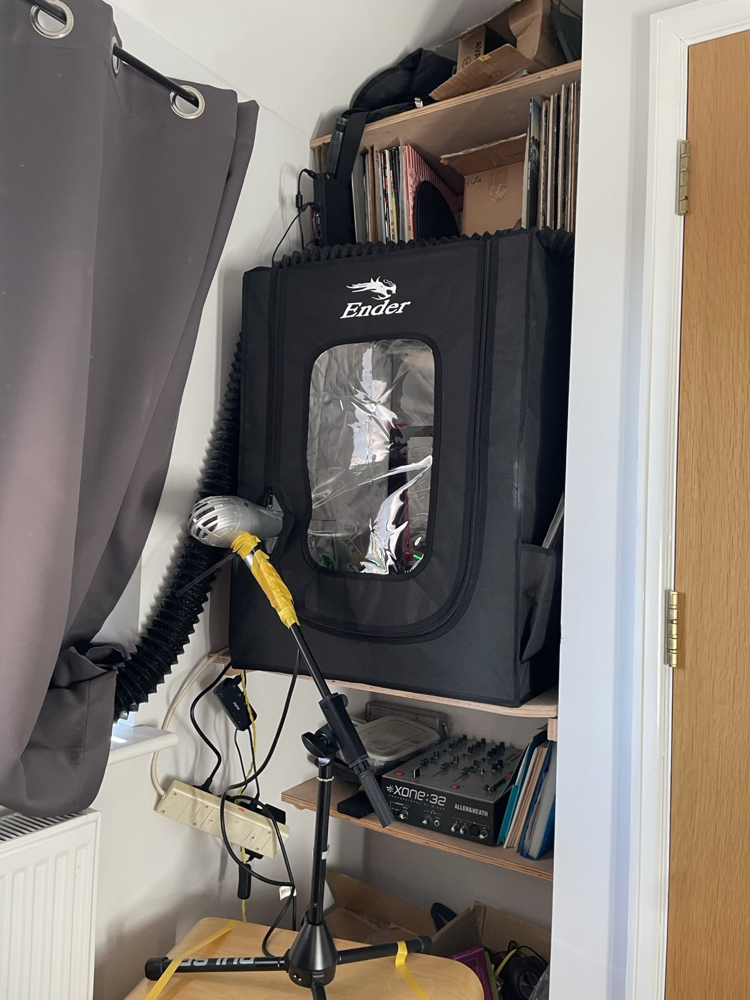

+++
title = "Voron Trident 300 Build: Part 6"
date = 2025-04-21
+++

A quick update, since I've been having fun building.

I've got the toolhead on, albeit with a waxy, warped fascia. I want to get the
thing printing before getting things perfect as my current printer is not as
well-enclosed as I'd like it to be and has issues with bed adhesion.

Don't do this. This was an attempt to get the enclosure up to temperature
faster. It definitely worked, but at the expense of the supports I'd printed
for the Ender in PLA.

The electronics bay work has begun. Most components are mounted and I'll soon begin wiring.

In other news, I've successfully got NixOS onto the Raspberry Pi 4 by
[cross-compiling the system closure I wanted](https://github.com/code-supply/code-supply/tree/main/boxes/ketchup-king). This was far easier than my
previous experiences with a Beaglebone Black. It just worked. I think the 3D
printing community, and especially build farms, could really benefit from some
Nix love to make imaging SBCs and configuring printers more reproducible. I may
well start a project in that space at some point.
